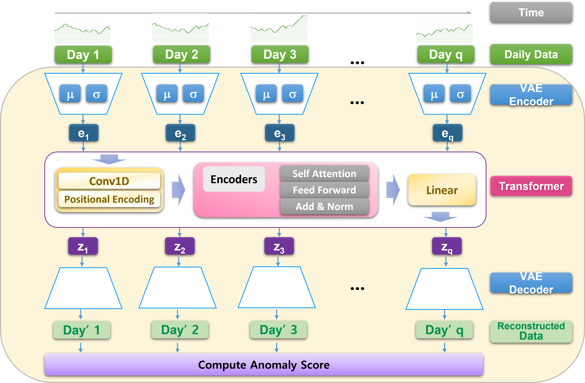
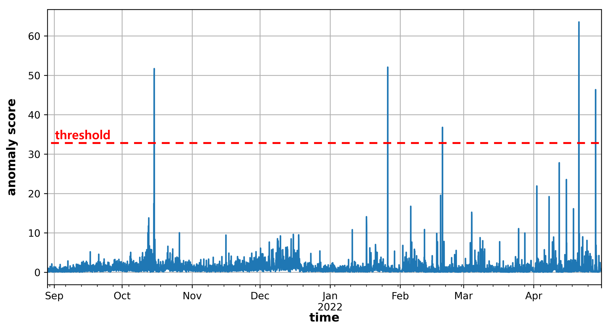

# Anomaly VAE-Transformer: A Deep Learning Approach for Anomaly Detection in Decentralized Finance

DeFi, a decentralized financial service based on blockchain, is growing to provide innovative financial services, but it also poses various risks, such as the Terra Luna crash. Therefore, to ensure the safety and reliability of the DeFi ecosystem, anomaly detection in DeFi is very important and necessary. However, due to the technical complexity of DeFi, such as the complex protocol and interaction of smart contracts, and the high market volatility, anomaly detection in DeFi is a very difficult challenge. 

In this paper, we propose a novel methodology to effectively detect anomalies in DeFi. To the best of our knowledge, this is the first study to utilize deep learning to detect anomalies in DeFi. We propose a novel deep learning model, Anomaly VAE-Transformer, which combines the variational autoencoder to extract local information in the short-term and the transformer to identify dependencies between data in the long-term. Based on a deep understanding of DeFi protocols, the proposed model collects and analyzes various on-chain data of Olympus DAO, one of the representative DeFi protocols, to extract features suitable for anomaly detection. Then, we demonstrate the superiority of the proposed model by analyzing four anomaly cases successfully detected by the proposed model in Olympus DAO in detail. By using the proposed method to detect anomalies in DeFi, it is possible to quickly identify malicious attack attempt and structural changes in DeFi protocols, which is expected to protect the assets of DeFi users and improve the safety, reliability, and transparency of the DeFi market. 



### Requirements
Dependencies can be installed by following the command below:
```
pip install -r requirements.txt
```

### Training
+ Train VAE
  ```
  python trainer_VAE.py
  ```
  
+ Train Transformer
  ```
  python main.py --mode train
  ```

### Analyzing & Detecting anomalies
+ Execute **process.ipynb** for calculating anomaly score
+ Execute **analysis.ipynb** for finding anomaly cases

+ Execute **visualize.ipynb** for visualizing detected anomaly cases
  + Case #1
  

